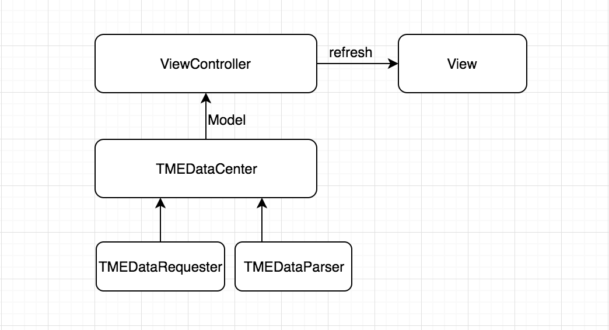

# TME-Demo

## Note
> This is an iOS demo project which allows the user to browse the Trade Me categories and displays the first 20 listings in each category.

## Development Environment
> Xcode Version 9.4
>
> Apple Swift version 4.1.2
>
> Apple iOS version  11.4

## Architecture

## Demo Videos 
>  1. iPhone
>  <video src="README-Sources/TME-Demo-iPhone.mov" width="375" height="667" controls="controls"></video>
>  
> 
>  2. iPad
>  <video src="README-Sources/TME-Demo-iPad.mov" width="640" height="480" controls="controls"></video> 

